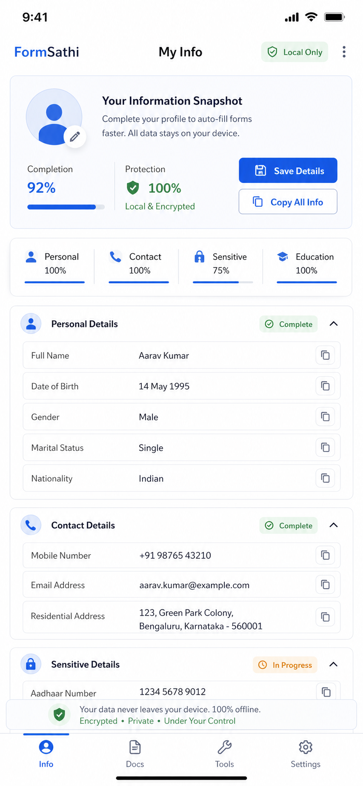

# Aadhaar JPG to PDF on Android

Users searching `aadhaar jpg to pdf` usually want one practical thing: convert front and back Aadhaar images into a single PDF that is easy to upload or share. This is a strong intent keyword because the user already knows the document and output format.

## When this is needed

This often comes up during:

- job applications
- college admissions
- KYC support requests
- government form uploads

## Best conversion workflow

1. Capture the Aadhaar front and back clearly.
2. Make sure both images are readable and not cut off.
3. Arrange the pages in the correct order.
4. Convert the images into one PDF.
5. If needed, reduce file size before upload.

## What FormSathi should help with

FormSathi’s value here is not just conversion. It is preparation:

- keep the images organized
- reuse them later
- export a clean PDF when needed
- avoid uploading raw gallery clutter

## Common issues

- back side missing
- blurry text
- oversized PDF
- page order wrong
- shadows or glare on the card

## SEO expansion ideas

This topic can later branch into:

- `aadhaar front and back pdf`
- `aadhaar image to pdf`
- `aadhaar card pdf for online form`
- `aadhaar pdf under 300kb`

## FAQ

### Should Aadhaar front and back be in one PDF?

Usually yes when the receiving portal asks for a single document, but the official instructions decide that.

### Is JPG better than PNG for Aadhaar scans?

JPG is usually smaller. PNG can be heavier unless the portal specifically asks for it.

### Can I make the PDF directly on my phone?

Yes. That is exactly the use case this article targets.
